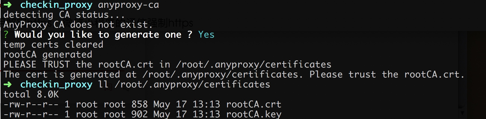
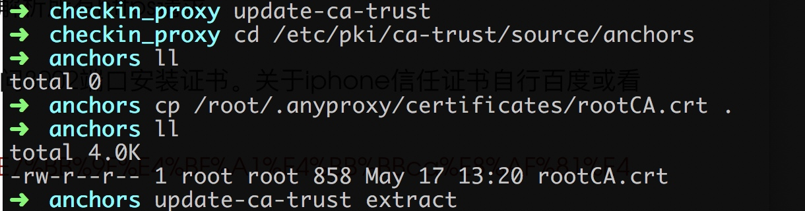
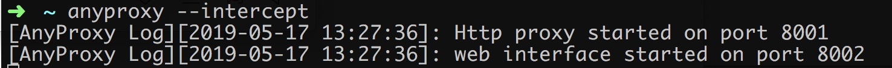
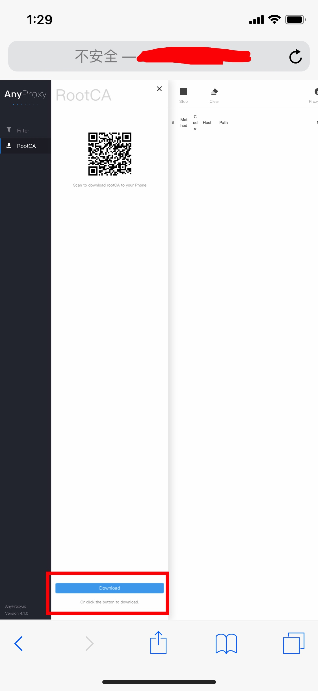
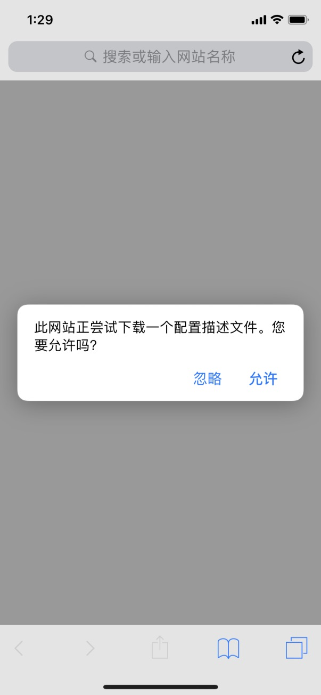
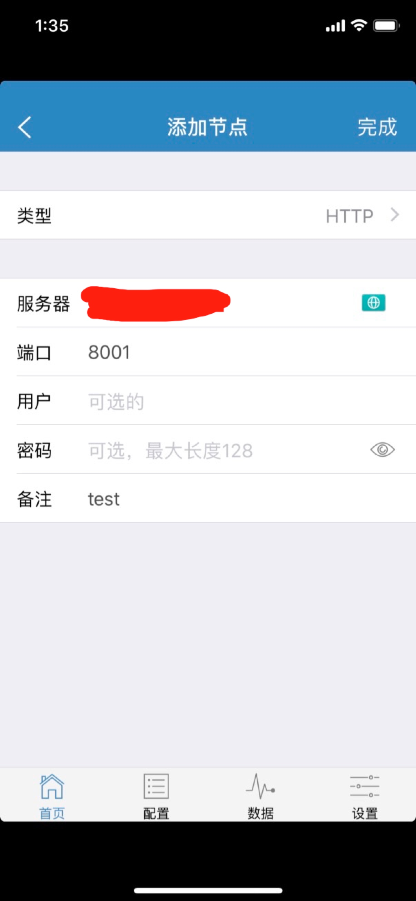
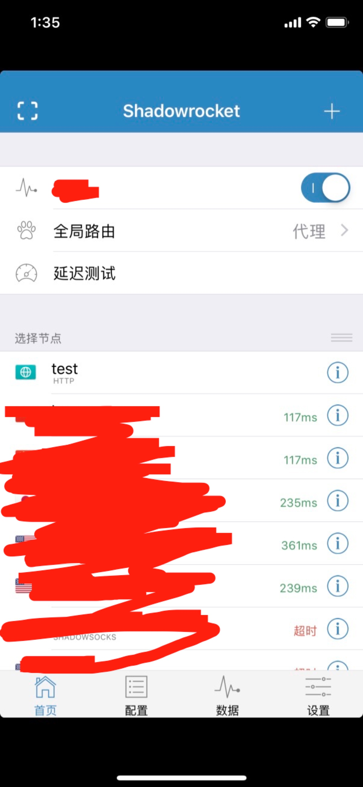
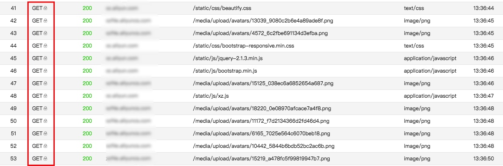
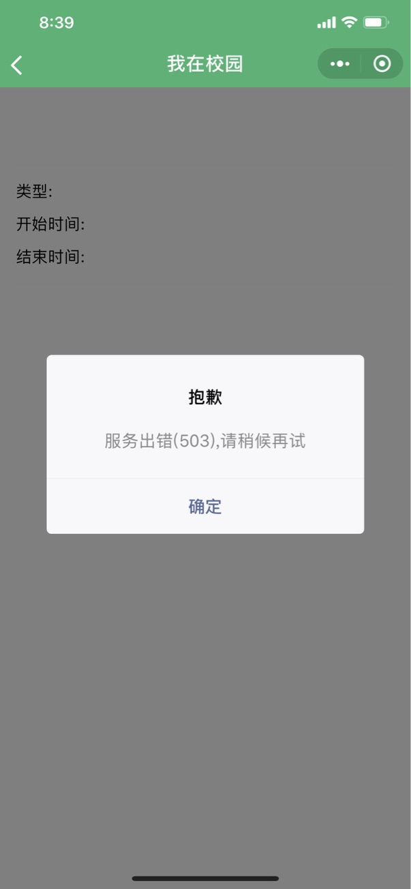

# wozaixiaoyuan_proxy
nodejs的http代理，解决“我在校园”校园签到时不在学校的问题。

## 原理
刚开始的尝试是在vps上跑一个脚本，一直向服务器发包，维持cookie的有效性，后来发现每日零点四分服务器会失效所有Cookie，遂改为代理。

签到时直接发送当前的经纬度，可进行修改，但是获取签到信息时会判断当前位置，如果不在签到范围内不允许点击签到。所以在查看签到详情的时候，在代理服务器中拿出cookie和logId，指定经纬度进行签到。

搜索发现阿里开源了一个nodejs的http代理，在此基础上添加了一个规则即可实现此功能。

ROOT后的安卓设备直接进行虚拟定位应该就可以实现任意位置签到的功能(没有测)，所以此代理服务器主要针对iOS设备和未ROOT的安卓设备，如何获取代理软件请自行探索。

## 准备工作
1. vps一台，代理默认8001口，Web管理页面接口8002
2. [node环境](https://nodejs.org/en/download/package-manager/#debian-and-ubuntu-based-linux-distributions-enterprise-linux-fedora-and-snap-packages) 我的版本是 v11.15.0

## 详细教程
为了让更多的人逃离校园签到的魔爪，所以我尽可能的写详细一些。

### 证书安装
由于要解密https，所以客户端(手机)和代理服务器都需要信任证书。

#### 全局安装anyproxy
npm install -g anyproxy 

#### 生成证书，默认证书路径是/root/.anyproxy/certificates
anyproxy-ca


#### 信任证书
CentOS信任证书的方法，其他系统请自行搜索。
>1. Install the ca-certificates package: yum install ca-certificates
>2. Enable the dynamic CA configuration feature: update-ca-trust force-enable
>3. Add it as a new file to /etc/pki/ca-trust/source/anchors/: cp foo.crt /etc/pki/ca-trust/source/anchors/
>4. Use command: update-ca-trust extract



#### 手机安装证书
anyproxy --intercept



 手机访问代理服务器地址8002端口（Web管理页面），下载证书并安装。
 




 iOS用户还需要再关于本机的证书信任设置信任该证书。
 
 

#### 测试
vpn设置http代理，模式使用代理，也就是全局模式。






连接后发现可以正常使用https流量，并且Web接口中发现请求方法旁边带锁，说明代理服务器已经可以解密https的流量了。


### 模块安装
```
git clone https://github.com/whip1ash/wozaixiaoyuan_proxy.git
cd wozaixiaoyuan_proxy
npm install 
npm start
```

长期后台运行 
使用pm2对进程进行管理

```
npm install pm2 -g
pm2 start proxy.js
```

更多操作请查看[官网](http://pm2.keymetrics.io/)

### 使用
由于微信做了证书绑定，微信小程序需要调用微信的用户登录接口，所以需要打开“我在校园”后再连接vpn，查询签到列表，点击详情，即可自动签到，返回503代表签到成功，其他状态均为失败。



## 关于修复
标准修复办法应该是在签到的包中加入token或者其他随机变量，由于微信小程序是可逆的，所以token或者随机变量的生成算法是可以被获取的。应该有更加完善的解决方法，可以一起留言讨论一下。

## TODO:
- [ ] 增加销假功能 (拖了好几个月了，懒......